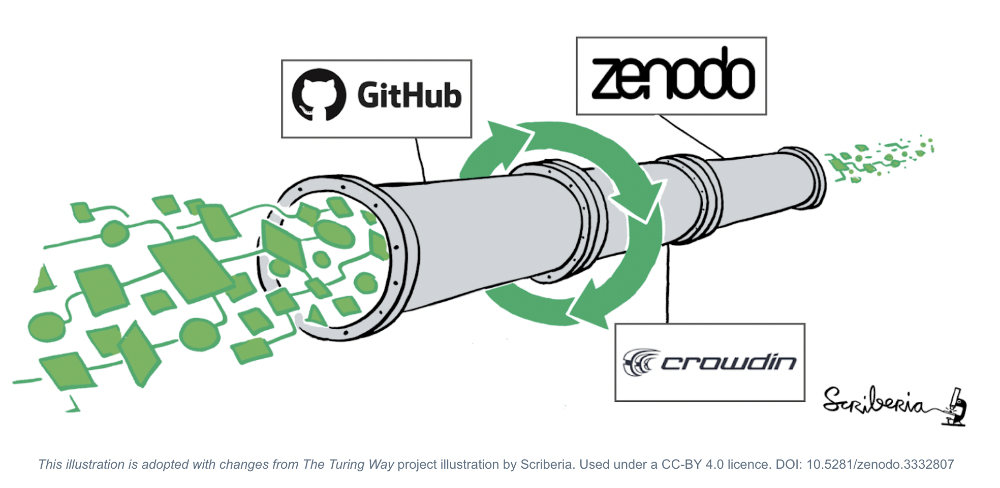

# Localisation

[![CC BY 4.0][cc-by-shield]][cc-by]

Open Science Community Saudi Arabia (OSCSA) aims to provide open educational resources (OERs) in Arabic. It works with other Open Sceince communities to localise their open educational resources (OER) using Crowdin, GitHub abd Zenodo. 

> Open Science community Saudi Arabia (OSCSA) was established in line with Saudi Arabia’s Vision 2030, which focuses on installing values, enhancing knowledge and improving equal access to education. It aims to provide a place where newcomers and experienced peers interact, inspire each other to embed open science practices and values in their workflows and provide feedback on policies, infrastructures and support services. Our community is part of the International Network of Open Science & Scholarship Communities (INOSC).

## Contributing :two_hearts:
- If you like it, leave your star in this project :star2:
- If you would like to complain/suggest/contribute to this project, feel free to open a issue :heart_decoration:
- Please follow our [Contributing guidelines](https://github.com/Open-Science-Community-Saudi-Arabia/localisation/blob/main/CONTRIBUTING.md). 

## License

This work is licensed under a
[Creative Commons Attribution 4.0 International License][cc-by].

[![CC BY 4.0][cc-by-image]][cc-by]

[cc-by]: http://creativecommons.org/licenses/by/4.0/
[cc-by-image]: https://i.creativecommons.org/l/by/4.0/88x31.png
[cc-by-shield]: https://img.shields.io/badge/License-CC%20BY%204.0-lightgrey.svg
