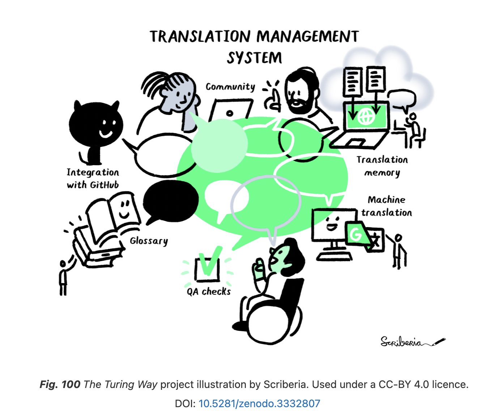

# Localisation
<!-- ALL-CONTRIBUTORS-BADGE:START - Do not remove or modify this section -->

<!-- ALL-CONTRIBUTORS-BADGE:END -->

[![CC BY 4.0][cc-by-shield]][cc-by]

**Open Science Community Saudi Arabia (OSCSA)** aims to introduce open educational resources (OERs) for Open Science in Arabic to facilitate learning of Open science practices to novice learners. Therefore, we work with other Open Science communities such as the Turing Way and Open Life Science to localise their open educational resources (OER) using Crowdin, GitHub and Zenodo.

> Open Science community Saudi Arabia (OSCSA) was established in line with Saudi Arabia’s Vision 2030, which focuses on installing values, enhancing knowledge and improving equal access to education. It aims to provide a place where newcomers and experienced peers interact, inspire each other to embed open science practices and values in their workflows and provide feedback on policies, infrastructures and support services. Our community is part of the International Network of Open Science & Scholarship Communities (INOSC).

### Workflow

**Localization** is a more comprehensive process than translation that addresses cultural and non-textual components as well as linguistic issues when adapting the text for another country or locale, as defined by [Stephanie Harris](https://www.vengaglobal.com/blog/translation-localization-difference/).

We use **GitHub** as a version control system for all the translations and to acknowledge all contributors. **Crowdin** is used as a translation management system (or TMS) to make contributions smooth. Any changes made to Crowdin will be reflected on GitHub using automation and continuous integration (CI). Crowdin provides Translation Memory (TM), Glossary, Machine Translation (MT) and QA checks.

We also use **Zenodo** to produce DOI that aids in citation tracking. More detailed guidelines for the translation is in the [Contributing guidelines](https://github.com/Open-Science-Community-Saudi-Arabia/localisation/blob/main/CONTRIBUTING.md). 

## Current Projects

- **Translation for Open Life Science Talks and Transcripts.**

Open Life Science (OLS) mentoring and training program has been running since January 2020 and offers a 16-week project-based opportunity to learn open science practices. To make some of its resources more accessible, [Talarify](https://twitter.com/talarify?lang=en) and [Open Science Community in Saudi Arabia](https://twitter.com/OpenSciSaudi) translated part of OLS3 cohort resources. More details can be found in [this respository](https://github.com/Open-Science-Community-Saudi-Arabia/ols3-cohort-talks-and-transcripts).

- **translation of _The Turing Way_.**
The Turing Way is a handbook to reproducible, ethical and collaborative data science. It supports a diverse community of contributors to make data science accessible, comprehensible and effective for everyone. Part of the topics in _the Turing Way_ was already translated to Spanish, OSCSA has introduced the same workflow to translate _the Turing Way_ to Arabic.

## Contributing :two_hearts:
- If you like it, leave your star in this project :star2:
- If you would like to complain/suggest/contribute to this project, feel free to open a issue :heart_decoration:
- Please follow our [Contributing guidelines](https://github.com/Open-Science-Community-Saudi-Arabia/localisation/blob/main/CONTRIBUTING.md). 

## License

This work is licensed under a
[Creative Commons Attribution 4.0 International License][cc-by].

[![CC BY 4.0][cc-by-image]][cc-by]

[cc-by]: http://creativecommons.org/licenses/by/4.0/
[cc-by-image]: https://i.creativecommons.org/l/by/4.0/88x31.png
[cc-by-shield]: https://img.shields.io/badge/License-CC%20BY%204.0-lightgrey.svg

## Contributors ✨

Thanks goes to these wonderful people ([emoji key](https://allcontributors.org/docs/en/emoji-key)):

<!-- ALL-CONTRIBUTORS-LIST:START - Do not remove or modify this section -->
<!-- prettier-ignore-start -->
<!-- markdownlint-disable -->
<table>
  <tbody>
    <tr>
      <td align="center"><a href="https://github.com/rnabage"> <b>Ruqayyah Nabage</b></a> <a href="https://github.com/Open-Science-Community-Saudi-Arabia/localisation/commits?author=rnabage" title="Documentation">📖</a> <a href="#translation-rnabage" title="Translation">🌍</a></td>
      <td align="center"><a href="https://github.com/Khadeeejah"> <b>KHADIJAH WURAOLA AMUSAT</b></a> <a href="#mentoring-Khadeeejah" title="Mentoring">🧑‍🏫</a></td>
      <td align="center"><a href="https://github.com/ThanaMeri"> <b>ThanaMeri</b></a> <a href="https://github.com/Open-Science-Community-Saudi-Arabia/localisation/commits?author=ThanaMeri" title="Documentation">📖</a> <a href="#translation-ThanaMeri" title="Translation">🌍</a></td>
    </tr>
  </tbody>
</table>

<!-- markdownlint-restore -->
<!-- prettier-ignore-end -->

<!-- ALL-CONTRIBUTORS-LIST:END -->

This project follows the [all-contributors](https://github.com/all-contributors/all-contributors) specification. Contributions of any kind welcome!